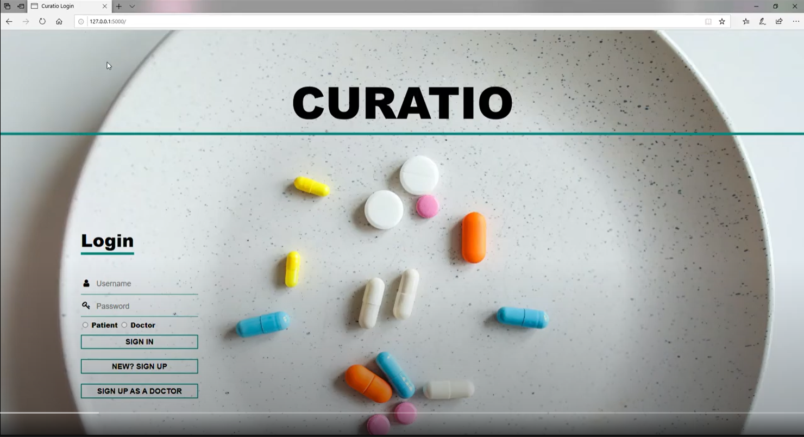

# Curatio
A solution to contact free healthcare for The Square Small Business Hackathon

## Inspiration
We wanted to come up with a simple solution for contactless healthcare.

## What it does
Curatio helps patients connect to doctors and receive information regarding healthcare according to the patients needs as much as possible without physically being in contact with the doctor or be at a hospital

## How we built it
Curatio has been made using the Flask web framework and Node.js runtime environment. We built it by combining multiple modules made from scratch, APIs from square and google cloud and also some open source modules that were made available to the public on the internet.

## Challenges we ran into
We had a difficult time building a database management system for the logging in module for the webapp. We also faced some challenges when implementing the video calling feature but much research and trials, we managed to make it work. Another challenge we were facing was trying to find the user location for our map based features but in the end we managed to overcome all of them.

## Accomplishments that we're proud of
We are proud of what we have built so far and believe that it is a well thought out solution for contactless healthcare. It was an amazing learning experience for us.

## What we learned
1) To make a low level database and manage it 
2) How to build a login and sign up system from scratch 
3) How to use flask 
4) How to use google maps API to find nearest locations of specific type of places (pharmacies/hospitals) 
5) How to create a search filter 
6) How to use node.js
7) How to build a video calling webpage using webRTC

## What's next for Curatio
We hope to build it into an even more well designed and full of features webapp that can help both doctors and patients during this time of social distancing.
